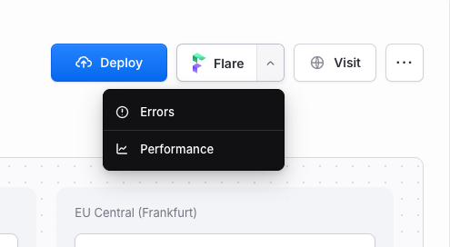

# Flare browser extension

Adds a Flare button immediately to the right of **Deploy** on Laravel Cloud. Connect the extension to Flare using its toolbar icon. For a matching project, the main button opens Flare Errors and its menu offers Errors, Performance, and Logs. When no project matches, **Set up Flare** opens the Laravel installation guide. When the extension is disconnected, **Connect Flare** opens its settings.

The connection uses Flare's read-only OAuth device flow. The extension stores the access and refresh tokens in browser extension storage, keeps them out of the Laravel Cloud page, and revokes them when you disconnect. Flare matches an exact allowed domain first, then an exact project name or slug.

The settings screen includes an option to hide **Set up Flare** on Laravel Cloud projects with no matching Flare project. Matched projects still show the Flare button.

## Install in Chrome locally

1. [Download the repository as a ZIP](https://github.com/spatie/flare-browser-extension/archive/refs/heads/main.zip) and unzip it. Keep the unzipped folder in a permanent location.
2. Open `chrome://extensions` in Chrome and enable **Developer mode**.
3. Click **Load unpacked** and select the `extension` folder inside the unzipped repository.
4. Click the Flare toolbar icon, connect your Flare account, and approve the read-only connection on Flare.
5. Open or refresh a Laravel Cloud project page. The Flare button appears beside **Deploy**.

To update this local installation, download the latest repository ZIP, replace the files in the same `extension` folder, click **Reload** on the Flare card in `chrome://extensions`, then refresh Laravel Cloud. Chrome must keep using that folder at the same path. A local installation does not update automatically.

## Development

Run `python3 scripts/watch_extension.py install` once to start the development watcher. Saving a file in `extension` then bumps the version automatically. An open Laravel Cloud page with the Flare button detects that version, reloads the unpacked extension, and refreshes itself within a few seconds. Chrome Developer mode must stay enabled. Keep the `extension` folder at the same path while Chrome uses it.

Run `python3 scripts/watch_extension.py uninstall` to stop the watcher. You can also publish a version manually with `python3 scripts/publish_dev.py`.

For a Chrome Web Store release, run `python3 scripts/package_chrome.py`. The ZIP in `dist/` excludes the development reload script and its permissions. Upload that ZIP to the Chrome Web Store and choose **Unlisted** visibility. Store copy and privacy disclosures are drafted in [store/listing.md](store/listing.md) and [PRIVACY.md](PRIVACY.md). Store releases are reviewed and update installed copies through Chrome.

Disable the unpacked development extension before installing the Web Store version in the same Chrome profile. Both copies would otherwise try to add the button to the same page.

## Safari on macOS

Open `safari/Flare for Laravel Cloud/Flare for Laravel Cloud.xcodeproj` in Xcode, select the macOS app target, and run it. In Safari, enable the extension in **Settings > Extensions** and allow access to `cloud.laravel.com`.

The Safari Xcode project references the files in `extension`, so changes to the shared extension source can be rebuilt in Xcode.

## Firefox

Run `python3 scripts/package_firefox.py` to build a Firefox add-on ZIP in `dist/`. For local testing, open `about:debugging` in Firefox, choose **This Firefox**, then **Load Temporary Add-on** and select the ZIP. Firefox removes temporary add-ons when it restarts. Regular installation requires [Mozilla signing](https://extensionworkshop.com/documentation/publish/signing-and-distribution-overview/).

Chrome, Safari, and Firefox use the same interface and connection code in `extension/`. The Firefox package changes only the browser-specific manifest and omits the Chrome development reload script. After editing shared files, rebuild the Safari app and regenerate both browser store packages before distributing them.

## Create a release

Push the latest `extension/` changes to `main`, then run **Release browser extensions** under GitHub Actions. The workflow uses the version in `extension/manifest.json`, checks that it has not been tagged, builds Chrome and Firefox ZIPs, lints the Firefox package, checks that Safari builds, and creates a GitHub release with both ZIPs. The Safari build is a verification build, not a signed app for distribution.

Leave **Submit Chrome update** off for the first Chrome Web Store release. Google requires the first item, its listing, and its unlisted visibility to be created in the developer dashboard. The API can then upload and submit later versions with the same visibility.

To enable Chrome submissions from the workflow, enable the Chrome Web Store API in a Google Cloud project, create a service account, add its email under the publisher's **Settings > Service account**, and configure GitHub to impersonate it through [Workload Identity Federation](https://github.com/google-github-actions/auth/blob/main/docs/EXAMPLES.md#workload-identity-federation-through-a-service-account). Set these repository Actions variables:

| Variable | Value |
| --- | --- |
| `CHROME_WEB_STORE_PUBLISHER_ID` | The publisher ID from the developer dashboard |
| `CHROME_WEB_STORE_ITEM_ID` | The extension ID after its first dashboard upload |
| `CHROME_WEB_STORE_SERVICE_ACCOUNT` | The linked service account email |
| `GCP_WORKLOAD_IDENTITY_PROVIDER` | The full Google Cloud provider resource name |

After the first unlisted Chrome release is published and these variables are configured, select **Submit Chrome update** when running the workflow. It uploads the new ZIP and submits it for review. Google publishes it after approval. The Firefox ZIP still needs Mozilla signing before it can be installed permanently.
